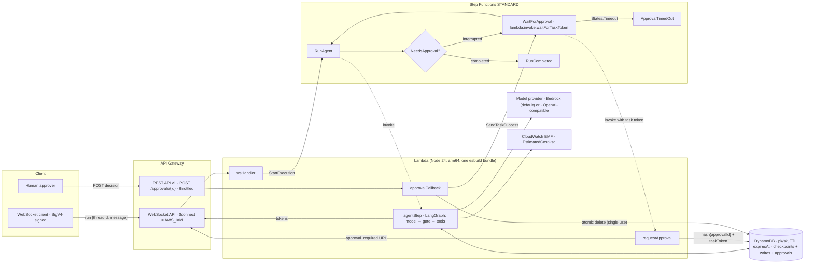

# ServerlessAgent

**Passes LangGraph's official checkpointer conformance suite (718/718) on a DynamoDB single-table saver, with 869 unit tests and `cdk synth` output that has zero IAM wildcard actions.** Estimated cost: about $0.001 per agent run and $0 when idle (an estimate for Nova Lite, not measured; [assumptions](docs/cost-estimate.md)). A CDK construct that deploys a LangGraph.js agent on AWS Lambda with durable DynamoDB checkpoints, WebSocket token streaming and Step Functions human approval.

The thesis is "the model proposes, the deterministic core disposes". The LLM can propose a sensitive tool call, but a deterministic gate node decides whether it runs. A sensitive call pauses the graph with `interrupt()`. Step Functions then holds a task token until a human approves through a single-use link. Unknown tools and malformed approvals fail closed.

## Architecture



## Usage

```ts
import { App, Duration, Stack } from 'aws-cdk-lib';
import { AgentModel, ServerlessAgent } from '@serverless-agent/construct';

const app = new App();
const stack = new Stack(app, 'AgentStack');
const agent = new ServerlessAgent(stack, 'SupportAgent', {
  model: AgentModel.bedrock('amazon.nova-lite-v1:0'),
  toolsRequiringApproval: ['send_email'],
  approvalTimeout: Duration.hours(4),
});
// agent.webSocketUrl, agent.approvalBaseUrl, agent.stateMachine, agent.table
```

WebSocket protocol, in brief:

1. The client connects with a SigV4-signed request (`$connect` uses IAM auth) and sends `{"action":"run","threadId":"t1","message":"..."}`.
2. The server replies `run_accepted`. Then `token` messages stream in, followed by `approval_required` (with an approval URL and the proposed tool calls), and finally `run_completed` or `run_failed`.
3. Approve or reject with `curl -X POST <approvalUrl> -d '{"decision":"approve"}'` (or `"reject"`, with an optional `"comment"`).

The v0.1 runtime ships a demo graph with two tools: `get_current_time`, and `send_email` (a stub that sends nothing).

## What gets deployed

| Resource | Why it scales to zero |
|---|---|
| DynamoDB table (`pk`/`sk`, TTL `expiresAt`, PITR, retained by default) | On-demand billing, so there is no capacity to pay for when idle |
| 3 Lambda functions, plus 1 for the WebSocket route (Node 24, arm64, one shared bundle) | No provisioned concurrency, no VPC, no NAT |
| Step Functions Standard state machine | Billed per state transition |
| API Gateway WebSocket API (optional, `webSocketApi: false` removes it) | Billed per message and connection-minute |
| API Gateway REST API, `POST /approvals/{approvalId}` | Billed per request, throttled |
| CloudWatch log groups with explicit retention | Storage only |

Every taggable resource carries the cost allocation tag `serverless-agent:agent-name`.

## Security

- No `*` in any IAM action. Tests enforce this on the synthesized template.
- `Resource: "*"` appears only for the CloudWatch Logs delivery actions that Step Functions logging requires.
- Each function gets only its own grants.
- The WebSocket `$connect` route requires IAM auth.
- Approval ids are 256-bit random values. Only their SHA-256 hash is stored, and each one is single use.
- The approval endpoint accepts `POST` only and is throttled.
- Bad input never consumes an approval. A malformed `approved` value counts as a rejection (fail closed).
- Anyone holding the approval URL can decide: there is no approver identity in v0.1 ([ADR 0004](docs/adr/0004-approval-as-interrupt-bridged-to-task-token.md)).

## Local development (LocalStack)

Prerequisites: Docker, and `LOCALSTACK_AUTH_TOKEN` in your shell environment. LocalStack 2026.03+ requires a token; the Hobby plan is free for non-commercial use. Never commit the token.

**serverless-agent uses LocalStack on port 4566.**

```bash
pnpm local:up            # LocalStack on 127.0.0.1:4566 + deterministic mock LLM
pnpm local:deploy        # build, synth, deploy ServerlessAgentLocal with an AWS SDK script
pnpm test:integration    # conformance suite on LocalStack DynamoDB, Lambda invoke, approval callback
pnpm local:down
```

The local stack uses the Hobby-plan profile: no WebSocket API (API Gateway v2 is not in Hobby), a mock LLM instead of Bedrock, and an SDK deploy instead of `cdk bootstrap` (ECR is not in Hobby). See [ADR 0009](docs/adr/0009-localstack-integration-environment.md).

Without a token, `pnpm test:integration` prints `SKIPPED` (not run) and exits 0; with a token but no LocalStack it exits 2 with a `BLOCKER` message. `pnpm local:deploy` without a token exits 2 before building. Nothing is faked.

## Testing

Measured on 2026-10-03 (see [DEVDOCS section 14](docs/DEVDOCS.md#14-results-v01)):

- `pnpm test`: 26 test files, 869 tests pass, with no network, Docker or AWS credentials. Runtime 814 (including the official LangGraph checkpointer conformance suite, 718 of 718 passing, run against an in-memory DynamoDB fake), construct 48 (CDK assertions and IAM invariants), mock LLM 7.
- `pnpm synth`: synthesizes `ServerlessAgentExample` (40 resources) and `ServerlessAgentLocal` (26 resources) with no credentials. Neither template has a wildcard IAM action.
- `pnpm test:integration`: needs Docker, LocalStack and a token. **Never run against LocalStack yet**: `LOCALSTACK_AUTH_TOKEN` was not available on the machine that built v0.1. Without the token it reports SKIPPED (exit 0); with a dummy token and no LocalStack it exits 2 with `BLOCKER`.

## Decisions

| ADR | What we gave up |
|---|---|
| [0001](docs/adr/0001-plain-typescript-workspace-jsii-compatible-api.md) Plain TypeScript workspace, jsii-compatible API | Construct Hub listing and multi-language bindings in v0.1 |
| [0002](docs/adr/0002-single-table-dynamodb-checkpointer.md) Single-table DynamoDB checkpointer | Checkpoints over 350 KB; cheap cross-thread listing |
| [0003](docs/adr/0003-every-run-is-a-step-functions-standard-execution.md) Every run is a Step Functions execution | Some start latency on every run |
| [0004](docs/adr/0004-approval-as-interrupt-bridged-to-task-token.md) Approval as `interrupt()` bridged to a task token | Approver identity |
| [0005](docs/adr/0005-websocket-streaming-from-the-agent-lambda.md) WebSocket streaming from the agent Lambda | Plain browser clients and mid-run reconnects |
| [0006](docs/adr/0006-pluggable-model-provider-and-estimated-cost-metrics.md) Pluggable model, estimated cost metrics | Exact billing in-app |
| [0007](docs/adr/0007-offline-testing-strategy.md) Offline testing strategy | Real-DynamoDB fidelity in unit tests |
| [0008](docs/adr/0008-prebundled-runtime-asset.md) Prebundled runtime asset | Per-function tree-shaking |
| [0009](docs/adr/0009-localstack-integration-environment.md) LocalStack integration environment | Local WebSocket and Bedrock coverage; the `cdk deploy` UX locally |

## Status

v0.1. **No real AWS deploy has been done yet**: only `cdk synth` and LocalStack. See [docs/handoff.md](docs/handoff.md) and [docs/DEVDOCS.md](docs/DEVDOCS.md).

## License

[MIT](LICENSE).
