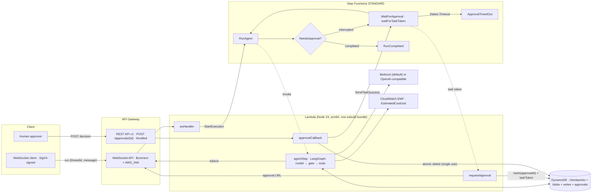

# ServerlessAgent: developer guide

Status: v0.1 complete locally (2026-10-04). Not deployed to real AWS. Not published.

## 1. What it is

ServerlessAgent is an AWS CDK v2 construct library. It deploys a LangGraph.js agent on AWS Lambda.

- State lives in DynamoDB, through a custom LangGraph checkpointer (`DynamoDBSaver`).
- Every run is a Step Functions Standard execution.
- Sensitive tool calls pause for a human. Step Functions holds a `waitForTaskToken` until someone approves through a single-use link.
- Tokens stream to the client over an API Gateway WebSocket.
- Everything scales to zero. IAM is least-privilege, and tests enforce it.

The idea is "the model proposes, the deterministic core disposes". The model may propose any tool call. A deterministic gate node decides if it runs. Unknown tools and malformed approvals fail closed.

**Headline (measured, 2026-10-04):** `DynamoDBSaver` passes LangGraph's official checkpointer conformance suite, **718/718**. The repo has 869 unit tests, all passing. Both synthesized templates have zero IAM wildcard actions.

Cost: about $0.001 per run and $0 when idle. This is an **estimate**, not a measurement. See `docs/cost-estimate.md`.

## 2. Quickstart (5 minutes)

You need Node 24, pnpm 9.12 (`corepack enable`) and Git. You do not need AWS credentials, Docker, a global CDK or the AWS CLI.

```bash
cd serverless-agent
pnpm install --frozen-lockfile
pnpm build        # tsc + esbuild runtime bundle (about 2.25 MiB)
pnpm test         # 869 offline unit tests
pnpm synth        # writes both example templates to examples/basic/cdk.out
```

Optional: run the agent against a local Ollama model. It asks you before it "sends" an email.

```bash
MODEL_ID=qwen3.8:27b pnpm --filter @serverless-agent/runtime run local -- "Please email bob@example.com saying hello"
```

Use the construct in your own stack:

```ts
import { AgentModel, ServerlessAgent } from '@serverless-agent/construct';

const agent = new ServerlessAgent(stack, 'SupportAgent', {
  model: AgentModel.bedrock('amazon.nova-lite-v1:0'),
  toolsRequiringApproval: ['send_email'],
  approvalTimeout: Duration.hours(4),
});
agent.webSocketUrl;     // wss://... (undefined when webSocketApi: false)
agent.approvalBaseUrl;  // https://....execute-api.../v1/
```

## 3. Architecture



### One run, step by step

1. The client opens the WebSocket with a SigV4-signed URL and sends `{"action":"run","threadId":"...","message":"..."}`.
2. `wsHandler` validates it and starts a Step Functions execution. The execution name is the `runId`.
3. `RunAgent` invokes `agentStep`. It runs the graph until it completes or interrupts. Tokens stream back in 64-character batches.
4. If the model proposes a sensitive tool, the gate calls `interrupt()`. The checkpoint is saved in DynamoDB.
5. `WaitForApproval` invokes `requestApproval` with a task token. It stores the SHA-256 hash of a 256-bit approval id and sends `approval_required` with the link.
6. The human POSTs `{"decision":"approve"|"reject"}`. `approvalCallback` deletes the approval item atomically (single use), checks expiry and calls `SendTaskSuccess`.
7. `RunAgent` runs again and resumes the graph from its checkpoint. Approved: the tool runs. Rejected or malformed: the tool never runs. No answer before `approvalTimeout`: `ApprovalTimedOut`.

### The checkpointer

- One table: `pk` (thread id) and `sk` (kind-prefixed sort key). On-demand billing, PITR on, TTL on `expiresAt`.
- Item kinds: checkpoint (`cp#`), channel blob (`bl#`), pending write (`wr#`) and approval (`approval#<sha256>`).
- Channel values are separate blob items, written only when the channel changes. The official suite requires this.
- The latest checkpoint is one `Query` (descending, `Limit 1`), because uuid6 ids sort by time.
- Pending writes are first-writer-wins, so Lambda retries are idempotent.
- Checkpoints over 350 KB throw `CheckpointTooLargeError`.

### Construct props (most used)

| Prop | Default | Notes |
|---|---|---|
| `model` | `AgentModel.bedrock()` (Nova Lite) | or `AgentModel.openAiCompatible({ baseUrl, modelId, apiKeySecret? })` |
| `toolsRequiringApproval` | `['send_email']` | `[]` disables approvals |
| `approvalTimeout` | 24 h | must be shorter than `maxRunDuration` |
| `maxRunDuration` | 7 days | state machine timeout |
| `checkpointTtl` | 30 days | TTL on every item |
| `webSocketApi` | `true` | `false` for LocalStack Hobby (no API Gateway v2) |
| `architecture` | `ARM_64` | |
| `removalPolicy` | `RETAIN` | table only |

The approval endpoint returns 200 (done), 400 (invalid, not used up), 404 (unknown or already used), 410 (expired) and 502 (upstream error, approval restored).

## 4. Project layout

| Path | What it holds |
|---|---|
| `packages/runtime` | `@serverless-agent/runtime` (ESM). `DynamoDBSaver`, the approval-gated graph, model factory, metrics, notifier, the four Lambda handlers, the local Ollama runner. |
| `packages/construct` | `@serverless-agent/construct` (CommonJS, jsii-compatible API). `ServerlessAgent`, `AgentModel`, and the esbuild bundle in `assets/runtime`. |
| `packages/integration` | LocalStack integration tests. They skip without a token. |
| `examples/basic` | Two example stacks: `ServerlessAgentExample` (AWS) and `ServerlessAgentLocal` (LocalStack), plus `scripts/deploy-local.mjs`. |
| `docker/mock-llm` | A deterministic OpenAI-compatible mock model, with its own tests. |
| `docker-compose.yml` | LocalStack on 4566 and the mock LLM on 18080. |
| `scripts/with-localstack-env.mjs` | Forces LocalStack endpoints and test credentials. Handles the token checks. |
| `.github/workflows/ci.yml` | Build, unit tests, synth, and token-gated integration. |
| `docs/adr` | Decisions 0001 to 0009. |
| `docs/superpowers` | The spec and the plans. |
| `.superpowers/sdd/progress.md` | The build ledger, with rulings. |

## 5. Run, test and benchmark

| Command | What it does | Last result (2026-10-04) |
|---|---|---|
| `pnpm install --frozen-lockfile` | install | exit 0 |
| `pnpm typecheck` | builds, then type-checks every package | exit 0 |
| `pnpm build` | tsc and the esbuild runtime bundle | bundle 2,358,669 bytes |
| `pnpm test` | offline unit tests | exit 0. runtime 18 files/814 tests, construct 7/48, mock-llm 1/7. Total 26 files, 869 tests. |
| `pnpm --filter @serverless-agent/runtime exec vitest run test/checkpointer/conformance.test.ts` | the conformance benchmark alone | 718 passed of 718 |
| `pnpm synth` | `cdk synth` of both example stacks, no credentials | exit 0. Example 40 resources, Local 26. |
| `pnpm test:integration` (no token) | integration entry point | exit 0, prints `SKIPPED` |
| `pnpm --filter @serverless-agent/integration-tests test` (no token) | integration files directly | exit 0, 3 files and 5 tests skipped |
| `LOCALSTACK_AUTH_TOKEN=dummy pnpm test:integration` | token set, LocalStack down | exit 2 with `BLOCKER` |
| `pnpm local:deploy` (no token) | LocalStack deploy | exit 2 with `ERROR`, before building |

IAM wildcard check on the synthesized templates (run after `pnpm synth`):

```bash
node -e "for (const s of ['ServerlessAgentExample','ServerlessAgentLocal']) { const t=require('./examples/basic/cdk.out/'+s+'.template.json'); const acts=Object.values(t.Resources).filter(r=>r.Type==='AWS::IAM::Policy').flatMap(r=>r.Properties.PolicyDocument.Statement).flatMap(st=>[].concat(st.Action)); console.log(s, acts.length, JSON.stringify(acts.filter(a=>String(a).includes('*')))); }"
```

Result on 2026-10-04: Example 40 actions, wildcards `[]`. Local 35 actions, wildcards `[]`.

With a LocalStack token (free Hobby plan, non-commercial):

```bash
export LOCALSTACK_AUTH_TOKEN=...   # never commit it
pnpm local:up
pnpm local:deploy
pnpm test:integration
pnpm local:down
```

Measured on Windows 11, Node v24.18.0, pnpm 9.12.0, no AWS credentials.

## 6. Key decisions and what they gave up

| ADR | Decision | What we gave up |
|---|---|---|
| [0001](adr/0001-plain-typescript-workspace-jsii-compatible-api.md) | Plain TypeScript pnpm workspace with a jsii-compatible API | Construct Hub and other-language bindings in v0.1 |
| [0002](adr/0002-single-table-dynamodb-checkpointer.md) | Single-table DynamoDB checkpointer with TTL | Checkpoints over 350 KB, cheap cross-thread listing, history past the TTL |
| [0003](adr/0003-every-run-is-a-step-functions-standard-execution.md) | Every run is a Step Functions Standard execution | Some start latency on every run (not measured) |
| [0004](adr/0004-approval-as-interrupt-bridged-to-task-token.md) | `interrupt()` bridged to a task token, with a single-use hashed link | Approver identity |
| [0005](adr/0005-websocket-streaming-from-the-agent-lambda.md) | WebSocket streaming from the agent Lambda, IAM auth, batching | Plain browser clients (they need SigV4), mid-run reconnects |
| [0006](adr/0006-pluggable-model-provider-and-estimated-cost-metrics.md) | Bedrock by default, OpenAI-compatible as an option, estimated cost metrics | Exact billing in the app |
| [0007](adr/0007-offline-testing-strategy.md) | CDK assertions, a strict DynamoDB fake, the official conformance suite | Real DynamoDB fidelity in unit tests |
| [0008](adr/0008-prebundled-runtime-asset.md) | One prebundled esbuild runtime asset | Per-function tree-shaking |
| [0009](adr/0009-localstack-integration-environment.md) | LocalStack Hobby environment, SDK deploy without bootstrap | Local WebSocket and Bedrock coverage, the `cdk deploy` flow locally |

Session rulings (in the ledger):
- Without a token, integration tests skip with exit 0. A skipped test is honest.
- Without a token, `local:deploy` exits 2. A deploy that did nothing must not report success.
- The README headline is the measured conformance result. The cost stays a labelled estimate.

## 7. Known limits and what's left

Limits:
- Not deployed to real AWS. Cold start, step latency and real cost are not measured.
- The LocalStack integration tests and `deploy-local.mjs` have never run. There is no token on this machine. Expect small emulation fixes on the first run.
- No approver identity. Whoever holds the link can decide.
- No per-thread run lock. Callers must not run two executions on one thread at once.
- Checkpoints over 350 KB are rejected (no S3 offload).
- The Lambdas use the managed `AWSLambdaBasicExecutionRole` for logs.
- The graph and tools are the built-in demo. Custom graphs via props are not supported yet.

Left for the user:
- Get a free LocalStack Hobby token, then run `pnpm local:up && pnpm local:deploy && pnpm test:integration`.
- Deploy to a real AWS sandbox and measure latency and cost.
- Choose an npm scope, add projen/jsii and publish to npm and Construct Hub.
- Push to a remote. Nothing has been pushed.

v0.2 ideas: custom graphs via props, S3 offload, Cognito/JWT approvers, SNS or Slack approval notices, run locking, a CloudWatch dashboard and alarms.
