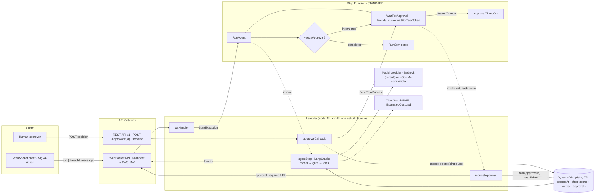

# ServerlessAgent: developer documentation

Status: **v0.1 planned, not yet built** (2026-10-03). Every number below is either a design target or a labelled **estimate** until the Results section is filled with measured values.

- Spec: `docs/superpowers/specs/2026-10-03-serverless-agent.md`
- Plan: `docs/superpowers/plans/2026-10-03-serverless-agent.md` (30 tasks)
- Decisions: `docs/adr/0001`–`0009`

## 1. Overview and goals

ServerlessAgent is an AWS CDK v2 construct library. It deploys a LangGraph.js agent on AWS Lambda with:

- durable state in DynamoDB (a custom LangGraph checkpointer);
- long runs in Step Functions, including a human-approval step that holds a `waitForTaskToken`;
- token streaming over an API Gateway WebSocket;
- a single-use HTTPS approval callback;
- estimated cost-per-run metrics and cost allocation tags;
- least-privilege IAM, enforced by tests;
- scale-to-zero everywhere.

The design thesis is **"the model proposes, the deterministic core disposes"**. The LLM may propose any tool call. A deterministic gate node decides whether that call needs a human. Only an explicit `approved: true` lets a sensitive tool run, and anything else fails closed.

Goals for v0.1:

1. A jsii-compatible construct API (`ServerlessAgent`, `AgentModel`) that synthesizes with no AWS credentials.
2. A `DynamoDBSaver` that passes LangChain's official checkpointer conformance suite.
3. Offline unit tests that prove the IAM and scale-to-zero invariants.
4. LocalStack-in-Docker integration tests for the checkpointer, the invoke path and the Step Functions approval callback.
5. Recruiter-facing docs: README headline number (estimate), architecture diagram, ADRs, cost model.

Non-goals for v0.1: real AWS deploy, Construct Hub publish (jsii), custom user graphs via props, S3 offload of large checkpoints, approver identity.

## 2. Architecture



**One code path.** Every run is a Step Functions Standard execution (ADR 0003):

1. The WebSocket handler starts it. The execution name is the `runId`.
2. `RunAgent` invokes the agent Lambda, which runs the graph until it completes or interrupts.
3. If the graph interrupts, `WaitForApproval` invokes `requestApproval` with a task token and waits up to `approvalTimeout`.
4. The approval callback resumes the execution with `SendTaskSuccess({ approved, comment })`.
5. `RunAgent` resumes the graph from its DynamoDB checkpoint with `Command({ resume })`.

## 3. Components and responsibilities

### 3.1 Construct package `@serverless-agent/construct` (CommonJS, jsii-compatible)

| Piece | Responsibility |
|---|---|
| `ServerlessAgent` | Creates the table, 3–4 Lambda functions, the state machine, the WebSocket API (optional) and the REST approval API. Wires environment variables, grants and tags. |
| `AgentModel` | Abstract provider choice. `bedrock(modelId?, { pricing? })` grants scoped `bedrock:InvokeModel*`. `openAiCompatible({ baseUrl, modelId, apiKeySecret?, pricing? })` grants only `secret.grantRead`. `bind(grantee)` returns environment variables. |
| `runtimeCode()` | Returns `lambda.Code.fromAsset(assets/runtime)` (the prebundled runtime, ADR 0008). Throws a clear error if the bundle is missing. |

**Construct props (`ServerlessAgentProps`):**

| Prop | Type | Default | Notes |
|---|---|---|---|
| `agentName` | string | construct id | `^[A-Za-z0-9-]{1,40}$`; used in tags and names |
| `model` | `AgentModel` | `AgentModel.bedrock()` (Nova Lite) | |
| `toolsRequiringApproval` | string[] | `['send_email']` | `[]` disables approvals |
| `systemPrompt` | string | (none) | |
| `approvalTimeout` | Duration | 24 h | must be < `maxRunDuration` |
| `maxRunDuration` | Duration | 7 days | state machine timeout |
| `checkpointTtl` | Duration | 30 days | DynamoDB TTL on every item |
| `agentTimeout` | Duration | 5 min | per agent step |
| `agentMemorySize` | number | 1024 | MB |
| `recursionLimit` | number | 25 | LangGraph recursion limit per step |
| `webSocketApi` | boolean | true | `false` for LocalStack Hobby (no API Gateway v2) |
| `architecture` | `lambda.Architecture` | `ARM_64` | `X86_64` on x86 LocalStack hosts |
| `lambdaRuntime` | `lambda.Runtime` | `NODEJS_24_X` | the bundle targets node22, so `NODEJS_22_X` also works |
| `logRetention` | `logs.RetentionDays` | `ONE_MONTH` | explicit log groups |
| `removalPolicy` | `RemovalPolicy` | `RETAIN` | table only |

**Construct outputs (public readonly members):**
- `agentName`, `table`, `agentFunction`, `requestApprovalFunction`, `approvalCallbackFunction`;
- `webSocketHandlerFunction?`, `webSocketApi?`, `webSocketStage?`, `webSocketUrl?`;
- `stateMachine`, `approvalApi`, `approvalBaseUrl`.

### 3.2 Runtime package `@serverless-agent/runtime` (ESM)

| Module | Responsibility |
|---|---|
| `checkpointer/dynamodb-saver.ts` | `DynamoDBSaver extends BaseCheckpointSaver`: `put`, `getTuple`, `list`, `putWrites`, `deleteThread`. Adds TTL and a size guard. |
| `agent/graph.ts` | `buildAgentGraph()`: nodes `model → gate → tools`. The gate is deterministic: it rejects unknown tools, calls `interrupt()` for sensitive tools and fails closed on resume. Also exports `pendingApproval(state)`. |
| `agent/tools.ts` | Demo tools: `get_current_time` (safe) and `send_email` (a stub that requires approval). |
| `agent/model.ts` | `createChatModel()`: `ChatBedrockConverse` or `ChatOpenAI` with `baseURL`. |
| `metrics.ts` | Token usage summing, `estimateCostUsd`, `buildEmfRecord` (namespace `ServerlessAgent`, dimension `AgentName`). |
| `notify.ts` | `Notifier`, `ApiGatewayNotifier` (best effort, `GoneException`-aware), `NullNotifier`, `TokenBatcher` (flushes at 64 characters). |
| `config.ts` | Validated environment parsing. |
| `handlers/agent-step.ts` | Runs one graph step. Streams tokens, returns `interrupted` or `completed`, emits EMF, notifies `run_failed` on error. |
| `handlers/request-approval.ts` | The waitForTaskToken target. Creates a 256-bit approval id, stores its SHA-256 hash with the task token, sends `approval_required`. |
| `handlers/approval-callback.ts` | REST proxy handler. Validates first, then claims the approval atomically, then calls `SendTaskSuccess`. Returns 200/400/404/410/502. |
| `handlers/websocket.ts` | `$connect`/`$disconnect` return 200. `$default` validates the message and calls `StartExecution`. |
| `handlers/index.ts` | The four Lambda entrypoints. Lazy dependency construction from the environment, so importing the module never throws. |

### 3.3 Checkpointer

`DynamoDBSaver` implements LangGraph's `BaseCheckpointSaver` from `@langchain/langgraph-checkpoint` 1.1.5:

- **Serialization** uses the saver's `serde` (async `dumpsTyped`/`loadsTyped`). Bytes are stored as DynamoDB Binary, with the type tag kept alongside.
- **Channel values** are stored as separate blob items keyed by channel and version (as the official Postgres saver does). The checkpoint item holds only the skeleton, and `put` writes blobs only for channels in `newVersions`. `getTuple` rebuilds `channel_values` from `channel_versions` with one `GetItem` per channel. The official suite requires this ("only store channel_values that have changed"). Unchanged-channel blobs get their TTL refreshed on each `put` (one conditional `UpdateItem` per unchanged channel per checkpoint, which costs a little in write units), so a long-lived thread never loses a blob its latest checkpoint references. Pre-v4 checkpoints also get their pending sends migrated from the parent's writes, as `MemorySaver` does.
- **Latest checkpoint:** a single `Query` with `ScanIndexForward=false, Limit=1`. This works because checkpoint ids are uuid6, which sort by time.
- **Pending writes:** a regular channel index is first-writer-wins (a conditional put, which makes Lambda retries idempotent). Special channels (errors, interrupts) overwrite.
- **Pagination:** every query follows `LastEvaluatedKey`.
- **`deleteThread`:** BatchWrite deletes in chunks of 25, retrying `UnprocessedItems` with backoff.
- **Guards:** `#` is not allowed in key parts (`InvalidKeyError`). A checkpoint whose skeleton, metadata and serialized channel values together exceed 350 KB throws `CheckpointTooLargeError`.
- **Verification:** the official `@langchain/langgraph-checkpoint-validation` suite runs against an in-memory DynamoDB fake (unit) and against LocalStack DynamoDB (integration).

## 4. Data model (single DynamoDB table)

Table: `pk` (S, partition key), `sk` (S, sort key), on-demand billing, TTL attribute `expiresAt` (epoch seconds), PITR enabled.

| Item kind | `pk` | `sk` | Other attributes |
|---|---|---|---|
| Checkpoint | `<thread_id>` | `cp#<checkpoint_ns>#<checkpoint_id>` | `kind='checkpoint'`, `threadId`, `checkpointNs`, `checkpointId`, `parentCheckpointId?`, `cpType`, `checkpoint` (B), `mdType`, `metadata` (B), `expiresAt?` |
| Channel blob | `<thread_id>` | `bl#<checkpoint_ns>#<urlencoded channel>#<urlencoded version>` | `kind='blob'`, `valueType`, `value` (B), `expiresAt?` |
| Pending write | `<thread_id>` | `wr#<checkpoint_ns>#<checkpoint_id>#<task_id>#<idx>` | `kind='write'`, `taskId`, `channel`, `idx` (N), `valueType`, `value` (B), `expiresAt?` |
| Approval | `approval#<sha256hex(approvalId)>` | `approval` | `kind='approval'`, `taskToken`, `runId`, `threadId`, `toolCalls` (JSON), `createdAt`, `expiresAt` |

Access patterns:

| Need | Operation |
|---|---|
| Latest checkpoint in a namespace | `Query pk=:thread AND begins_with(sk, 'cp#<ns>#')`, descending, `Limit 1` |
| A specific checkpoint | `GetItem` |
| Writes for a checkpoint | `Query begins_with(sk, 'wr#<ns>#<id>#')` |
| Thread history | `Query begins_with(sk, 'cp#')`, descending, with in-memory `before`/`filter`/`limit` |
| All threads (debug only) | `Scan` with filter `begins_with(sk, 'cp#')`; approval items are excluded |
| Approval claim | `DeleteItem` with `attribute_exists(pk)` and `ReturnValues=ALL_OLD` (atomic, single use) |

TTL: `checkpointTtl` (default 30 days) is stamped on every checkpoint and write when it is written. Approval items expire at `approvalTimeout`. DynamoDB TTL deletion is lazy, so it can lag by up to about 48 hours. The callback therefore also checks `expiresAt` itself and returns 410.

## 5. Public API

### 5.1 Construct

```ts
import { AgentModel, ServerlessAgent } from '@serverless-agent/construct';

const agent = new ServerlessAgent(stack, 'SupportAgent', {
  model: AgentModel.bedrock('amazon.nova-lite-v1:0'),
  toolsRequiringApproval: ['send_email'],
  approvalTimeout: Duration.hours(4),
});
agent.webSocketUrl;      // wss://… (undefined when webSocketApi: false)
agent.approvalBaseUrl;   // https://….execute-api…/v1/
agent.stateMachine;      // sfn.StateMachine
agent.table;             // dynamodb.Table
```

### 5.2 Runtime exports

`DynamoDBSaver`, `DynamoDBSaverOptions`, `InvalidKeyError`, `CheckpointTooLargeError`, `MAX_CHECKPOINT_BYTES`, `buildAgentGraph`, `pendingApproval`, `ApprovalRequest`, `ApprovalDecision`, `demoTools`, `createChatModel`, `estimateCostUsd`, `buildEmfRecord`, `usageFromMessages`, `ApiGatewayNotifier`, `NullNotifier`, `TokenBatcher`, `createAgentStepHandler`, `createRequestApprovalHandler`, `createApprovalCallbackHandler`, `createWebSocketHandler`, `hashApprovalId`, `approvalKey`, and the config helpers.

### 5.3 Wire protocols

- **WebSocket, client to server:** `{"action":"run","threadId":"<[A-Za-z0-9_-]{1,128}>","message":"<1-16000 chars>"}`.
- **WebSocket, server to client:**
  - `run_accepted {runId}` (route response)
  - `run_started {runId, threadId}`
  - `token {runId, text}`
  - `approval_required {runId, approvalUrl, toolCalls, expiresAt}`
  - `run_completed {runId, output}`
  - `run_failed {runId, error:"Agent step failed"}`
- **Approval:** `POST {approvalBaseUrl}approvals/{43-char id}` with body `{"decision":"approve"|"reject","comment"?:string≤1000}`.
  - 200 `{status, runId}`
  - 400 invalid (not consumed)
  - 404 unknown or used
  - 410 expired
  - 502 upstream error (restored)

### 5.4 Lambda environment variables

| Function | Variables |
|---|---|
| agentStep | `AGENT_NAME`, `TABLE_NAME`, `MODEL_PROVIDER`, `MODEL_ID`, `MODEL_BASE_URL?`, `MODEL_API_KEY_SECRET_ARN?`, `PRICE_INPUT_USD_PER_MTOK`, `PRICE_OUTPUT_USD_PER_MTOK`, `CHECKPOINT_TTL_SECONDS`, `TOOLS_REQUIRING_APPROVAL`, `RECURSION_LIMIT`, `SYSTEM_PROMPT?`, `WEBSOCKET_CALLBACK_URL?` |
| requestApproval | `TABLE_NAME`, `APPROVAL_TTL_SECONDS`, `APPROVAL_BASE_URL`, `WEBSOCKET_CALLBACK_URL?` |
| approvalCallback | `TABLE_NAME` |
| wsHandler | `STATE_MACHINE_ARN` |

## 6. Key flows

### 6.1 Invoke (start a run)

1. The client opens `wss://…/live` with a SigV4-signed URL. `$connect` uses IAM auth.
2. The client sends `{"action":"run",…}`. `wsHandler` validates it and calls `StartExecution(name=runId, input={threadId, message, connectionId})`, then replies `run_accepted`.
3. `RunAgent` invokes `agentStep` with `{ runId, input: $ }`.

### 6.2 Stream

1. `agentStep` runs `graph.stream(…, { streamMode: 'messages' })`.
2. Chunks from the `model` node go through `TokenBatcher` (64 characters) to `postToConnection`.
3. A `GoneException` marks the connection dead. Any other error is logged and dropped. The run never fails because of streaming.
4. At the end of the step, the handler sums token usage over the new AI messages only, logs one EMF line and returns its result.

### 6.3 Long run with approval

1. The model proposes `send_email`. The gate calls `interrupt({ kind:'tool_approval', toolCalls })`, and the checkpoint is saved in DynamoDB.
2. `agentStep` returns `{ status:'interrupted', interrupt }`. Choice goes to `WaitForApproval`.
3. `requestApproval(taskToken)` stores `approval#sha256(id)` and sends `approval_required` with `approvalUrl`.
4. The human POSTs a decision. `approvalCallback` validates it, atomically deletes the item (single use), checks expiry and calls `SendTaskSuccess({approved, comment})`.
5. Step Functions puts the decision at `$.resume` and loops to `RunAgent`. `agentStep` resumes the graph with `Command({ resume })` against the saved checkpoint.
6. Outcomes:
   - Approved: the tool runs and the model answers, ending in `run_completed`.
   - Rejected or malformed: a "Rejected by human reviewer" `ToolMessage` goes back to the model, and the tool never runs.
   - No decision before `approvalTimeout`: `ApprovalTimedOut`.

## 7. IAM and limits invariants (and how tests enforce them)

| Invariant | Enforced by |
|---|---|
| No IAM action contains `*` | `packages/construct/test/invariants.test.ts`, run for both the default and the local profile, plus the synth spot-check in plan Task 30 |
| `Resource: "*"` only for allowlisted CloudWatch Logs delivery actions (Step Functions logging) | `invariants.test.ts` (allowlist in the test; changes require an ADR) |
| No `NotAction`; no managed policies except `AWSLambdaBasicExecutionRole` | `invariants.test.ts` (that managed policy is a known v0.2 item, ADR 0008) |
| Per-function grants | agentStep: data plus Bedrock plus ManageConnections; requestApproval: writes plus ManageConnections; approvalCallback: writes plus `states:SendTask*`; wsHandler: `states:StartExecution` only. Checked in `invariants.test.ts`. |
| Bedrock scoped to the configured model or profile | `agent-model.test.ts`, `invariants.test.ts` |
| Scale-to-zero: no provisioned concurrency, VPC, NAT, versions or aliases; DynamoDB on-demand; Step Functions STANDARD | `invariants.test.ts` |
| TTL on `expiresAt`; PITR; retained table | `serverless-agent-core.test.ts`; saver TTL tests |
| Approval step exists: `lambda:invoke.waitForTaskToken`, timeout, loop to `RunAgent`, `States.Timeout` to `ApprovalTimedOut` | `state-machine.test.ts` |
| `$connect` uses `AWS_IAM`; the REST approval route is POST-only and throttled (10 rps, burst 20); no API Gateway account role | `apis.test.ts` |
| Payload limits: output ≤ 32,000 characters; message ≤ 16,000; checkpoint ≤ 350 KB; comment ≤ 1,000 | handler and saver unit tests |

## 8. Local dev setup and exact commands

Prerequisites: Node 24, pnpm 9.12 (`corepack enable`), and Docker (only for LocalStack). There is no global CDK and no AWS CLI. Everything runs from devDependencies.

```bash
pnpm install
pnpm build            # tsc + esbuild runtime bundle into packages/construct/assets/runtime
pnpm test             # offline unit tests (no network, no Docker, no AWS creds)
pnpm synth            # cdk synth both example stacks into examples/basic/cdk.out
```

**LocalStack (port 4566, ADR 0009).** LocalStack 2026.03+ requires an auth token. The free Hobby plan (non-commercial use) covers every service the local stack uses.

```bash
export LOCALSTACK_AUTH_TOKEN=…        # never commit it; PowerShell: $env:LOCALSTACK_AUTH_TOKEN='…'
pnpm local:up                          # docker compose: localstack:4566 + mock-llm
pnpm local:deploy                      # build + synth + SDK deploy of ServerlessAgentLocal (no bootstrap/ECR)
pnpm test:integration                  # checkpointer conformance + invoke path + approval callback
pnpm local:down
```

`scripts/with-localstack-env.mjs` forces `AWS_ENDPOINT_URL=http://localhost:4566` and `test` credentials, so a local command can never reach real AWS. If LocalStack is not reachable, it exits 2 with a BLOCKER message.

**Ollama (optional, manual):** `MODEL_ID=<tool-capable model> pnpm --filter @serverless-agent/runtime run local -- "email bob"` runs the same graph against `http://localhost:11434/v1` with interactive approvals.

## 9. Testing strategy

| Layer | What | Where | Needs |
|---|---|---|---|
| Unit: checkpointer | put/get/list/writes/delete, pagination, TTL, size, key validation | `packages/runtime/test/checkpointer` | nothing |
| Conformance | the official LangGraph checkpointer suite against the in-memory DynamoDB fake | `conformance.test.ts` | nothing |
| Unit: agent | gate rules (safe, sensitive, mixed, unknown, approve, reject, malformed); interrupt survives a new saver | `test/agent/graph.test.ts` (scripted model) | nothing |
| Unit: handlers | streaming, usage, EMF, failure notice; approval id hashing; callback status matrix; WebSocket validation | `test/handlers` | nothing |
| Construct | `Template.fromStack` resources, state machine definition, APIs, IAM invariants, scale-to-zero | `packages/construct/test` | the bundle (built by the test script) |
| Synth | both example stacks | `pnpm synth` | nothing |
| Mock LLM | reply logic plus OpenAI-compatible HTTP and SSE | `docker/mock-llm/server.test.mjs` | nothing |
| Integration | conformance on LocalStack DynamoDB; Lambda Invoke of `agentStep`; StartExecution → REST approve/reject → SUCCEEDED; single use | `packages/integration` | Docker, LocalStack, token |

Fakes:
- `FakeDocumentClient` understands only the exact expressions the saver emits and throws on anything else. It mimics undefined-value rejection, pagination, conditional failures and unprocessed batch items.
- `ScriptedChatModel` returns queued `AIMessage`s.

Integration tests never skip. Without LocalStack they fail with an explicit BLOCKER.

## 10. Cost model (estimates)

**All figures are estimates** from public us-east-1 list prices as remembered on 2026-10-03. They are not measured. Full arithmetic is in `docs/cost-estimate.md`.

Scenario: one run with one approval, 3 model calls, 6,000 input and 600 output tokens on Nova Lite.

| Component | Estimate per run |
|---|---|
| Step Functions (6 transitions × $0.025/1k) | $0.00015 |
| Lambda (about 8.15 GB-s arm64 + 5 requests) | $0.00011 |
| DynamoDB on-demand (about 128 WRU + 20 RRU) | $0.00008 |
| WebSocket messages (about 50, batched) | $0.00005 |
| REST approval request | $0.0000035 |
| Bedrock Nova Lite ($0.06 / $0.24 per 1M tokens) | $0.00050 |
| CloudWatch Logs (about 10 KB) | $0.000005 |
| **Total** | **≈ $0.0009 per run (≈ $0.90 per 1,000 runs)** |

- Idle cost: $0 compute; storage only (DynamoDB GB-month plus PITR, plus logs), estimated well under $0.10/month for a small table.
- Sensitivity: a Claude-Sonnet-class model at $3/$15 per 1M tokens (estimate) brings the run to ≈ $0.027, and the model then dominates.
- In production, the per-step EMF metric `ServerlessAgent/EstimatedCostUsd` and the `serverless-agent:agent-name` cost allocation tag show real spend.

## 11. Milestones

### v0.1 (this plan, `docs/superpowers/plans/2026-10-03-serverless-agent.md`)

| # | Task | Commit subject |
|---|---|---|
| 1 | Scaffold workspace | chore: scaffold pnpm workspace for runtime and construct packages |
| 2 | DynamoDB document client fake | test(runtime): add in-memory DynamoDB document client fake |
| 3 | Saver put/getTuple | feat(runtime): persist LangGraph checkpoints to DynamoDB |
| 4 | putWrites | feat(runtime): store pending writes alongside DynamoDB checkpoints |
| 5 | list and deleteThread | feat(runtime): list checkpoint history and delete threads |
| 6 | TTL and size guard | feat(runtime): expire checkpoint items with DynamoDB TTL and guard item size |
| 7 | Conformance suite | test(runtime): run LangGraph checkpointer conformance suite against DynamoDBSaver |
| 8 | Cost and EMF metrics | feat(runtime): estimate per-step cost and emit CloudWatch EMF metrics |
| 9 | Notifier and batching | feat(runtime): add best-effort WebSocket notifier with token batching |
| 10 | Env config | feat(runtime): parse and validate Lambda environment configuration |
| 11 | Model factory | feat(runtime): add Bedrock and OpenAI-compatible model factory |
| 12 | Approval-gated graph | feat(runtime): add approval-gated LangGraph agent with demo tools |
| 13 | agentStep handler | feat(runtime): add agent step handler with streaming, usage and failure notices |
| 14 | requestApproval handler | feat(runtime): issue single-use approval links for Step Functions task tokens |
| 15 | approvalCallback handler | feat(runtime): add single-use HTTPS approval callback that resumes Step Functions |
| 16 | WebSocket handler | feat(runtime): start agent runs from WebSocket messages |
| 17 | Entrypoints and bundle | build(construct): bundle runtime Lambda handlers with esbuild |
| 18 | AgentModel | feat(construct): add pluggable AgentModel with least-privilege grants |
| 19 | Construct core | feat(construct): add ServerlessAgent table, functions and cost tags |
| 20 | State machine | feat(construct): add Step Functions run loop with waitForTaskToken approval |
| 21 | APIs | feat(construct): add IAM-authorized WebSocket API and throttled REST approval endpoint |
| 22 | Invariants | test(construct): enforce least-privilege IAM and scale-to-zero invariants |
| 23 | Example stacks and synth | feat(examples): add AWS and LocalStack example stacks that synth offline |
| 24 | Mock LLM and compose | feat(local): add deterministic OpenAI-compatible mock LLM and LocalStack compose file |
| 25 | LocalStack deploy | feat(local): deploy the example stack to LocalStack without bootstrap or ECR |
| 26 | Integration tests | test(integration): cover checkpointer, invoke path and approval callback on LocalStack |
| 27 | Ollama runner | feat(runtime): add local chat runner for Ollama with interactive approvals |
| 28 | README and cost doc | docs: add README with architecture, usage and estimated cost per run |
| 29 | CI | ci: run build, unit tests, synth and token-gated LocalStack integration |
| 30 | Verification and handoff | docs: record v0.1 verification results and handoff |

### Stretch / v0.2

- **Real AWS deploy** to a sandbox account. Measure cold start, p50/p99 step latency and actual cost per run, and replace the estimates with measured numbers.
- projen + jsii build and publishing to npm and Construct Hub (Python bindings).
- Custom graphs and tools via props (`agentCode: lambda.Code` or an entry point).
- S3 offload for large checkpoint values.
- An approver identity (Cognito/JWT authorizer), plus Slack/SNS approval notifications.
- Step retry from the last checkpoint after a Lambda timeout.
- Per-thread run locking (a conditional lock item).
- Scope the Lambda log permissions inline instead of `AWSLambdaBasicExecutionRole`.
- A CloudWatch dashboard and alarms (cost per run, approval latency, failures).
- An Evalgate (shortlist #3) agent regression suite gating this repo's CI.

## 12. Decisions

| ADR | Decision | What we gave up |
|---|---|---|
| [0001](adr/0001-plain-typescript-workspace-jsii-compatible-api.md) | Plain TypeScript pnpm workspace, jsii-compatible API | Construct Hub listing and multi-language bindings in v0.1 |
| [0002](adr/0002-single-table-dynamodb-checkpointer.md) | Single-table DynamoDB checkpointer with TTL | Checkpoints over 350 KB; cheap cross-thread listing; full history past the TTL |
| [0003](adr/0003-every-run-is-a-step-functions-standard-execution.md) | Every run is a Step Functions Standard execution | About 100–300 ms start latency on every run (estimate) |
| [0004](adr/0004-approval-as-interrupt-bridged-to-task-token.md) | `interrupt()` bridged to a task token; single-use hashed capability URL on a REST API | Approver identity |
| [0005](adr/0005-websocket-streaming-from-the-agent-lambda.md) | WebSocket streaming via postToConnection, IAM auth, batching | Plain browser clients (need SigV4); mid-run reconnects |
| [0006](adr/0006-pluggable-model-provider-and-estimated-cost-metrics.md) | Bedrock by default, OpenAI-compatible pluggable; EMF cost estimates | Exact billing in-app |
| [0007](adr/0007-offline-testing-strategy.md) | CDK assertions, strict DynamoDB fake, official conformance suite | Real-DynamoDB fidelity in unit tests (covered by LocalStack integration) |
| [0008](adr/0008-prebundled-runtime-asset.md) | Prebundled esbuild runtime asset | Per-function tree-shaking |
| [0009](adr/0009-localstack-integration-environment.md) | LocalStack Hobby-compatible integration env; SDK deploy without bootstrap; REST approvals | Local WebSocket coverage; Bedrock locally; the `cdk deploy` UX locally |

## 13. Open questions

1. **npm scope and package names.** The `@serverless-agent/*` names are placeholders. Which npm scope or GitHub org will publish (v0.2)?
2. **LocalStack token.** `LOCALSTACK_AUTH_TOKEN` is not set on this machine, so integration tests are blocked until a free Hobby token is created (non-commercial use). For a commercial context, a Base plan or LocalStack's OSS sponsorship would be needed.
3. **Node 24 on LocalStack Lambda.** This is unconfirmed in the docs. The local stack uses Node 22. Re-check when the token is available.
4. **Approval delivery when no WebSocket client is connected.** Options: SNS/email, Slack, or a polling endpoint. Which one fits the demo?
5. **Approver authentication.** Cognito user pool vs a Slack-signed request vs IAM. This matters for the "who approved" audit trail.
6. **Concurrent runs on one thread.** Should the construct enforce a lock, or document that it is caller-managed?
7. **Default model and prices.** Confirm current Nova Lite pricing and whether a Claude model via an inference profile should be the showcased default.

## 14. Results (v0.1)

Measured on 2026-10-03 on Windows 11 (Git Bash and PowerShell), Node v24.18.0, pnpm 9.12.0. The tree was cleaned first (`packages/*/lib`, `packages/construct/assets`, `examples/basic/cdk.out` removed), then `pnpm install --frozen-lockfile` was run. No AWS credentials were used. Nothing was committed.

| Command | Exit | Result |
|---|---|---|
| `pnpm install --frozen-lockfile` | 0 | lockfile up to date; `pnpm why vitest -r` shows only vitest 4.1.11 |
| `pnpm typecheck` (builds first, because the example and integration packages import built `lib` output) | 0 | runtime, construct, integration and example all pass |
| `pnpm build` | 0 | `bundled runtime -> assets\runtime\index.mjs (2.25 MiB)` |
| `pnpm test` | 0 | 25 test files, 866 tests, all passing (details below) |
| `pnpm synth` | 0 | writes both templates, no credentials |
| `pnpm --filter @serverless-agent/integration-tests typecheck` | 0 | |
| `pnpm test:integration` | **2** | BLOCKER, see below |

**Test counts.**

| Package | Files | Tests |
|---|---|---|
| `@serverless-agent/runtime` | 17 | 811 |
| `@serverless-agent/construct` | 7 | 48 |
| `@serverless-agent/mock-llm` | 1 | 7 |
| **Total** | **25** | **866** |

**Conformance suite:** 718 passed out of 718, no skips (`test/checkpointer/conformance.test.ts`, against the in-memory DynamoDB fake). Runtime breakdown: 718 conformance, 22 saver unit tests, 10 fake-client tests, 61 other tests (metrics, notify, config, model, graph, handlers, exports, smoke).

**Synthesized templates** (`examples/basic/cdk.out`):

| Stack | Resources | Template bytes | Notes |
|---|---|---|---|
| `ServerlessAgentExample` | 40 | 46,111 | 1 DynamoDB table, 1 WebSocket API (`ApiGatewayV2::Api`), 4 Lambda functions, 1 state machine, 1 REST API, 5 log groups |
| `ServerlessAgentLocal` | 26 | 32,307 | no `ApiGatewayV2` resources, 3 Lambda functions, 1 state machine, 1 REST API, 4 log groups |

**IAM wildcard spot-check** (all `AWS::IAM::Policy` statements in the synthesized templates): `ServerlessAgentExample` 40 actions, wildcards `[]`; `ServerlessAgentLocal` 35 actions, wildcards `[]`. The unit invariants (`packages/construct/test/invariants.test.ts`) were also seen to fail when a `dynamodb:*` action and a `Resource: "*"` on `dynamodb:GetItem` were added on purpose, then reverted.

**Docker and CI checks.**
- `docker compose config --quiet` without a token fails fast: `required variable LOCALSTACK_AUTH_TOKEN is missing a value: LOCALSTACK_AUTH_TOKEN is not set. LocalStack 2026.03+ requires it; ...`. With a dummy token set in the process environment only, it exits 0.
- The mock LLM container (`node:24-alpine`, standalone `docker run`) answered `GET /health` with `{"ok":true}` and returned a `send_email` tool call from `POST /v1/chat/completions`.
- `rhysd/actionlint:latest` on `.github/workflows/ci.yml`: exit 0, no findings.

**LocalStack integration: BLOCKED, not run.** `LOCALSTACK_AUTH_TOKEN` is not set on this machine, so LocalStack was never started (2026-10-03). `pnpm test:integration` printed, verbatim:

```
BLOCKER: LocalStack is not reachable at http://localhost:4566 (fetch failed).
Start it with "pnpm local:up". LocalStack 2026.03+ requires LOCALSTACK_AUTH_TOKEN in your environment (free Hobby plan for non-commercial use). See docs/adr/0009.
```

and exited with code 2. Running the three integration files directly with Vitest fails each of them with `BLOCKER: LocalStack not reachable at http://localhost:4566 (fetch failed). Run "pnpm local:up" with LOCALSTACK_AUTH_TOKEN set (ADR 0009).`. `examples/basic/scripts/deploy-local.mjs` passes `node --check` but has never been executed against LocalStack. The invoke path and the approval callback have therefore only been proven by unit tests.

**Local runner (optional).** Ollama was running with `qwen3.8:27b`. `pnpm --filter @serverless-agent/runtime run local` made the model propose `send_email` and reached the `approve? [y/N]` prompt, so the `interrupt()` gate works against a real model. With piped stdin the script then exited with `ERR_USE_AFTER_CLOSE` (readline closes at end of input). An interactive terminal run was not done.

**Not measured:** cold start, step latency and real AWS cost (no real AWS deploy). The cost figures in this document and in `docs/cost-estimate.md` remain estimates.
